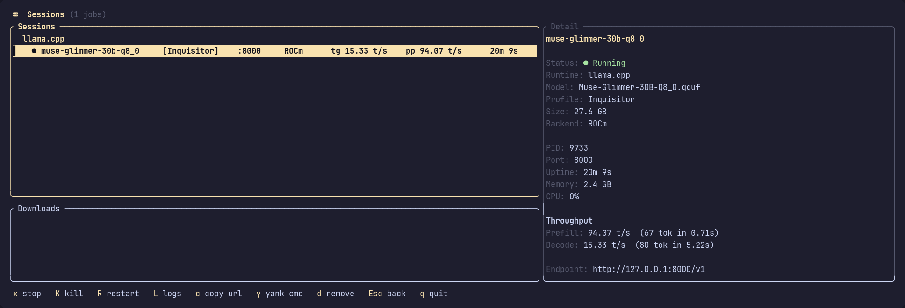
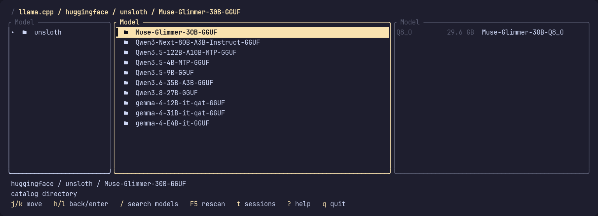
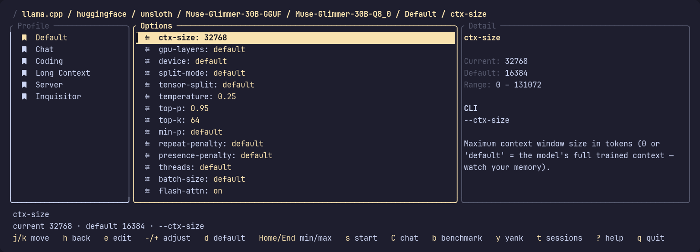

# llmctl

A keyboard-driven terminal UI (TUI) for discovering, configuring, launching, and
managing local LLM inference servers — in the style of [Yazi](https://github.com/sxyazi/yazi),
[Lazygit](https://github.com/jesseduffield/lazygit), and `systemctl`.

The goal: **never hand-type a complex inference-server command again.** Browse
your models, tune launch options with live validation, start detached servers,
and watch them from a built-in session manager.

> **Status:** v0.5.0. Two runtimes ship on **Linux**: **llama.cpp + GGUF**
> (CPU/GPU) and **FastFlowLM** (`flm`, AMD XDNA2 NPU). Others (vLLM, Ollama, …)
> are future work behind the `RuntimeBackend` trait.



## Features

- **Two runtimes, one workflow** — llama.cpp for CPU/GPU GGUF inference, and
  FastFlowLM (`flm`) for models on an AMD XDNA2 NPU. Everything runtime-specific
  — binary discovery, option vocabulary, templates, catalog, launch/chat/benchmark
  commands, readiness checks — sits behind a `RuntimeBackend` trait, so both
  runtimes browse, configure, launch, and monitor identically.
- **Yazi-style navigation** — a sliding three-column view over the hierarchy
  `Runtime ▸ source ▸ provider/repository ▸ Model ▸ Profile ▸ Options`, driven entirely from the keyboard
  (`hjkl`, `g`/`G`, drill in / back out).
- **Model discovery** — recursively scans your configured directories, or (when
  none are configured) well-known locations (llama.cpp cache, HuggingFace hub,
  LM Studio, `~/models`).
  Reads GGUF headers for architecture, context length, quantization, and embedded
  chat template; detects integrated MTP heads and pairs `mtp-*.gguf`,
  `dflash-*.gguf`, and `mmproj-*.gguf` companions with their base models;
  dedupes multi-shard models
  and sums their sizes. `F5` to rescan.
- **Physical model catalog** — mirrors discovery below
  `~/.config/llmctl/models` using source-aware folders, safe manifests, model
  symlinks, and per-model YAML profiles. Press `/` to search recursively from
  the current local catalog directory.
- **Online Hugging Face catalog** — browse `online ▸ huggingface` like a local
  directory. It lazily caches 30 trending llama.cpp-compatible GGUF repositories
  and their artifacts; drafter and projector companions remain attributes of their base
  model, and starting a remote model lets llama.cpp download it into the standard
  Hugging Face cache.
- **Profiles & options** — built-in, read-only templates (Default, Chat, Coding,
  Long Context, Server) that fork into per-model editable instances on first edit.
  Edit options with live validation, cycle enums/flags in place, and adjust
  numerics with `+`/`-`/`[`/`]` or jump to default/min/max with `Home`/`End`.
  All edits auto-save, scoped per **runtime + model**.
- **Launch command builder** — assembles the exact `llama-server` invocation from
  the resolved options. `y` previews and yanks the command to your clipboard
  (OSC 52); options left at their default are omitted so llama.cpp's own defaults
  apply.
- **FastFlowLM on the NPU** — the `flm` catalog, grouped by capability label
  (reasoning, vision, tool-calling, audio, embeddings) under the same
  `local`/`online` split. NPU-specific options (power mode, prefill chunk,
  queue length) and templates, `flm serve` sessions, `flm run` chat, and `flm
  bench` benchmarking. Downloads are llmctl's own, so they resume. The XDNA
  driver grants a single hardware context, so llmctl runs one FastFlowLM model
  at a time and says which session holds the device.
- **Storage you can take back** — `D` removes a model's files from disk, asking
  once and quoting what it frees. It identifies the hash-named blobs behind a
  Hugging Face artifact, keeps companions another quantization still needs, and
  keeps your profiles.
- **Detached sessions** — `s` launches a server in its own process group
  (`setsid`), with stdout/stderr redirected to a per-session log file and
  automatic port-conflict resolution. Sessions are rediscovered across restarts.
- **Session manager** (`t`) — sessions grouped under the runtime serving them,
  in aligned columns of live status (Downloading /
  Starting / Running / Crashed), model, profile, port, size, compute backend
  (ROCm / Vulkan / CUDA / NPU), throughput (`tg` and `pp` in tokens per second,
  as the server last reported them), and uptime. Plus PID and `/proc`-sampled
  CPU & memory;
  a `/health` probe promotes Downloading → Starting → Running. Stop (`x`),
  kill (`K`), restart (`R`), copy endpoint (`c`), and tail the log — `l` beside
  the list, `L` full screen.

## Requirements

- **Linux** (`setsid`, `/proc` sampling, and POSIX signals).
- **A terminal of at least 80×24.** Below that llmctl says so rather than
  drawing a frame nothing fits in; above it panes and columns are shed as room
  runs out.
- **At least one runtime.** Each is optional and discovered independently; a
  runtime that is missing or unusable is still listed, with the reason shown in
  the status line instead of failing at launch.
  - **[llama.cpp](https://github.com/ggml-org/llama.cpp)** — `llama-server` on
    your `$PATH` (or an absolute path in the config). `llama-cli` beside it
    enables the chat shortcut (`C`), `llama-bench` the benchmark shortcut (`b`).
  - **[FastFlowLM](https://github.com/FastFlowLM/FastFlowLM)** — `flm` on your
    `$PATH`, plus an AMD XDNA2 NPU with a working driver stack. `flm validate`
    gates launching, so a missing driver or too low a memlock limit is reported
    up front. `flm` may be a wrapper script (a distrobox entry point, say);
    llmctl re-acquires the real server process either way.
- **Rust** (edition 2024) to build — install via [rustup](https://rustup.rs).

## Install

Build a release binary from source:

```sh
git clone https://github.com/zeddius1983/llmctl.git
cd llmctl
cargo build --release
```

The binary lands at `target/release/llmctl`. Copy it onto your `$PATH`, e.g.:

```sh
install -Dm755 target/release/llmctl ~/.local/bin/llmctl
```

Or install straight from the checkout:

```sh
cargo install --path .
```

## Usage

Just run it:

```sh
llmctl
```

Navigate `Runtime ▸ Model ▸ Profile ▸ Options`, tune a profile, then press `s`
to launch (or `y` to copy the command). Press `?` at any time for the keybinding
overlay.



### Keybindings

| Key | Action |
|-----|--------|
| `j` / `k` | Move down / up |
| `l` / `→` | Drill into selection |
| `h` / `←` | Back up a level |
| `g` / `G` | First / last item |
| `/` | Search recursively in the current catalog directory |
| `s` | Sort online models: Trending / Most likes / Most downloads |
| `d` | Download the selected online GGUF file |
| `D` | Delete the selected model from disk (asks first) |
| **Profiles** | |
| `a` | Create profile |
| `r` | Rename (custom profiles only) |
| `D` | Duplicate profile |
| `d` | Delete custom / reset built-in profile |
| `f` | Toggle favorite |
| **Options** | |
| `e` | Edit / cycle value |
| `-` / `+`, `[` / `]` | Decrement / increment |
| `Home` / `End` | Default·min / max |
| **Launch & sessions** | |
| `s` | Start server |
| `C` | Chat in terminal (`llama-cli` / `flm run`) |
| `b` | Benchmark the selected model (`llama-bench` / `flm bench`, when available) |
| `y` | Yank launch command |
| `t` | Session manager |
| `x` / `K` | Stop / kill a server; cancel a download |
| `R` | Restart a server or resume a download |
| `l` / `→` | Tail the session's log beside the list (again for Detail) |
| `L` | View the log full screen |
| `c` | Copy endpoint |
| **General** | |
| `F5` | Rescan / reload |
| `?` / `q` | Help / quit |

### Session throughput

Each session shows its speed, read from the timings the server already writes to
its own log — nothing to enable, and it works for sessions llmctl rediscovered
after a restart. `tg` is token generation (decode) and `pp` is prompt processing
(prefill), each the runtime's own figure for its most recent request rather than
an average llmctl computed — only the server knows how much of the elapsed time
was work rather than idling. The Detail pane adds the tokens and duration behind
each.

Sessions are grouped under the runtime serving them, so "what have I got up on
the NPU?" is one glance rather than a scan down a backend column. Columns are
model, profile, port, size, compute backend, `tg`, `pp`, and uptime; a narrow
pane sheds the least useful first, so the list never wraps and the Detail pane
always has all of them. Within a row nothing is ever omitted — a session that
has served no requests shows `tg --.-- t/s`, so its columns still line up with
those of a busy one.

### Launch options

Each runtime exposes its own curated option set, edited with live validation and
auto-saved per model. llama.cpp covers context size, GPU layers, device
selection, sampling, threads and batching, flash attention, KV cache types,
multi-GPU placement, server slots, speculative decoding, and host/port —
including `mtp-*`, `dflash-*`, and `mmproj-*` companions found beside a model,
which are wired to the right flag on their own. An NPU has none of those, so
FastFlowLM gets its own vocabulary: power mode, context and prefill chunk
length, queue length, preemption, and the ASR and embedding companions, each
clamped to what the selected model supports. Options left at their default are
omitted from the command line.



## Configuration

llmctl follows the XDG base-directory spec and runs with **zero setup**. On the
first run it creates `~/.config/llmctl/config.toml` with the llama.cpp cache,
Hugging Face, LM Studio, and `~/models` sources. Edit that file to add a source:

```toml
[[models.sources]]
name = "nas"
path = "/mnt/nas/llms"
layout = "directory" # auto, directory, flat, lm-studio, or hugging-face

[runtime.llama_cpp]
# Binary name (resolved on $PATH) or an absolute path.
binary = "llama-server"

# FastFlowLM runs models on an AMD XDNA2 NPU. Its catalog comes from `flm`
# itself, so the model sources above do not apply to it.
[runtime.fastflowlm]
binary = "flm"

[defaults]
host = "127.0.0.1"
port = 8000
```

### On-disk locations

| Path | Purpose |
|------|---------|
| `~/.config/llmctl/config.toml` | Configuration |
| `~/.config/llmctl/config.yaml` | Ignored legacy configuration; archive after migrating anything useful |
| `~/.config/llmctl/models/` | Managed source tree, symlinks, and YAML profiles |
| `~/.local/state/llmctl/` | Session records, logs, and profile migration fallback |
| `~/.cache/llmctl/` | Model & runtime scan cache |
| `~/.config/flm/models/` | FastFlowLM's own models, owned by `flm` (or `$FLM_MODEL_PATH`) |

The generated file explicitly lists the standard locations so they are easy to
inspect and extend. Older `[models].paths` arrays remain supported, but named
`[[models.sources]]` entries provide stable catalog names and layout control.
Your `$HOME` is never scanned wholesale.

### Removing a model

`D` on a model in the browser removes its files from local storage — the
mirror image of `d`. It asks first, quoting the model and the space it frees:
`Remove Muse-Glimmer-30B-UD-Q4_K_XL.gguf (15.1 GB) from disk?`. `y` or Enter
goes ahead, any other key cancels.

This matters most for the Hugging Face cache, where a model is a set of
hash-named blobs that cannot be identified by eye: `D` maps the artifact you
selected in the browser onto the exact blobs, snapshot links, and — once the
repository holds nothing else — the whole `models--org--repo` directory. It
works the same way on scanned GGUFs and on FastFlowLM's model directories —
including a GGUF llmctl found by *scanning* the Hub cache, where the file is a
symlink and the bytes are in the blob behind it.

A projector or dFlash drafter shared with another quantization you still have
is kept, and the quoted size excludes it. Profiles for the model are kept too,
so re-downloading it restores your settings. A model with a live session, or one
currently downloading, is refused until you stop it.

### Online models

Under the llama.cpp runtime, enter `online`, then `huggingface`, for 30 trending
GGUF repositories — or `/` to search the Hub. Pick an artifact, configure a
profile as usual, and `s` launches it straight from the Hugging Face cache while
`d` downloads it first. Downloads run concurrently in their own pane below
Sessions, bring each model's companion files with them, and resume after a
cancel (`x`) or an llmctl restart (`R`). `s` on a repository list cycles the sort
between trending, most likes, and most downloads. Set `HF_TOKEN` in the
environment for gated or private models; llmctl never persists it.

## License

[MIT](LICENSE)
